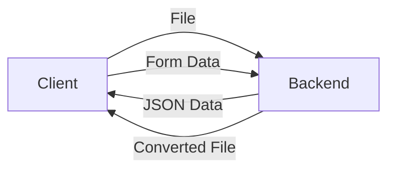

# Excel to H2K

Full-stack node application to convert Excel reports to H2K files.

## Building and Running

Install packages with:

```bash
npm install
```

Start the server with:

```bash
npm start
```

## Configuration

Configuration stored in `.env` file. Configuration options are listed below.

- `PORT` - Port the HTTP server is to listen on. Must be a valid port for the user running the node process.

## Backend Documentation

Generate the API with `apidoc` using `npx`:

```bash
npx apidoc -c "./apidoc.json" -i .
```

You can view generated docs with the `http-server` module. This creates a temporary server on port 4444 to serve the docs.

```bash
npx http-server -p 4444
```

Then, navigate to http://localhost:4444/docs.

## Backend Dependencies

These dependencies are required for the proper functioning of the backend component of the project. They do not have any affiliation whatsoever with the author of this repository. Licensing agreements may differ depending on the dependency.

- Body Parser - HTML form parser. Does not support multipart file uploads (see <https://www.npmjs.com/package/body-parser>). 
- Dotenv - Loads environment variables from `.env` file into `process.env`. Simplifies configuration (see <https://www.npmjs.com/package/dotenv>).
- Embedded JavaScript (EJS) - Templating engine compatible with Express. plugs data into slots of a sample XML file. Necessary since the schema of the H2K spec. was unknown when development began (see <https://www.npmjs.com/package/ejs>).
- Express - Web framework for Node.js (see <https://www.npmjs.com/package/express>).
- Express File Upload - Adds parsing support to express for file uploads in HTML forms (see <https://www.npmjs.com/package/express-fileupload>).
- SheetJS (community edition) - Excel workbook parser. Parses `.xlsx` into `.json` to be read by the rest of the app (see <https://www.npmjs.com/package/xlsx>). 

## Frontend Dependencies

These dependencies are required for the proper functioning of the frontend component of the project. They do not have any affiliation whatsoever with the author of this repository. Licensing agreements may differ depending on the dependency.

- JQuery - Cross-platform library in javascript that simplifies DOM interactions (see <https://jquery.com/>).
- JQuery File Download - Small plugin script for JQuery that implements `$.fileDownload` to request a file from the server (see <https://github.com/johnculviner/jquery.fileDownload/blob/master/src/Scripts/jquery.fileDownload.js>).
- Mustache - Small javascript templating library (see <https://github.com/janl/mustache.js/>).

## How it Works

The file is uploaded to the server, parsed as JSON and returned to the client. An invisible form is then filled out the client side automatically and sent back to the server, which responds with the converted file (see flowchart below).



## Media Licenses

The pieces of media listed below are used in various parts of the user-facing component of the application. Their respective affiliations and licensing agreements are listed separately.

- Image at path `./images/energy3r-logo.png` is a variant of the Energy 3R logo included with permission of the firm. See <https://energie3r.ca/en/>.
- Image at path `./images/energy3r.gif` is a gif used for the loading animation modelled on the logo listed above. It was generated using a third-party tool with no affiliation to the author. see <https://loading.io/>.
- Image at path `./images/background-image.jpg` is a corporate branding overlay modified . Original Stock image was provided by Energy3R.

## Other Liscences

The H2K file type is part of the HOT2000 software suite developed by Natural Resources Canada (see <https://www.nrcan.gc.ca/energy-efficiency/homes/professional-opportunities/tools-industry-professionals/20596>).

## Disclaimer

This security of this application has not yet been thoroughly tested. Running this application in a production environment is not recommended.

This author was commissioned to write this application by Energy 3R to create a minimum viable product (MVP), to be used by a future team to further develop a proprietary application. It was made public with authorization of the firm, and was modified slightly to remove confidential information.

## Contribute

See `TODO.md` file for a list of possible improvements.

## Sponsor


